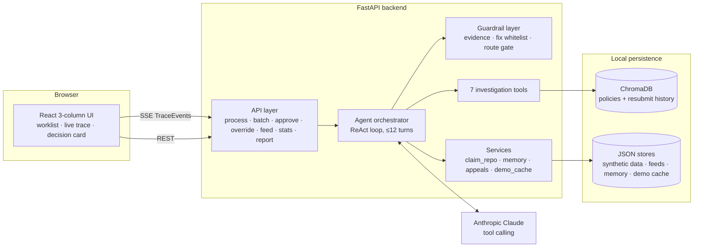
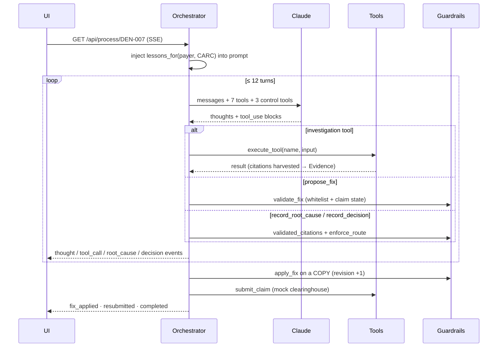
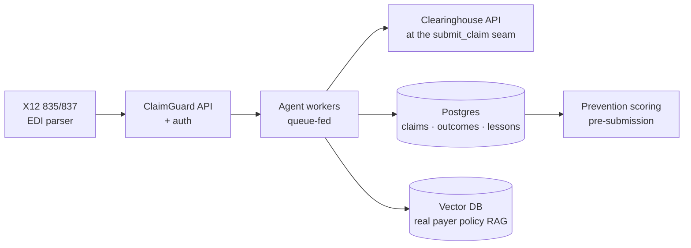

# ClaimGuard — Architecture & Design Document

**Team Denial Detectives · CitiusTech Hackathon 2026**
**Version 1.0 · July 2026**

---

## 1. Purpose & scope

ClaimGuard is an AI agent that investigates denied US healthcare claims, determines the
*true* root cause (which frequently differs from the payer's stated CARC reason code),
commits to one of four triage routes with cited evidence, and acts on the decision —
auto-fixing and resubmitting, drafting an appeal letter, writing off, or escalating to a
human with the proposed fix held for one-click approval.

This document describes the system's architecture, the design principles behind it, and
the reasoning for the major decisions. Scope: the entire `claimguard/` codebase (backend,
frontend, data pipeline, tests, demo infrastructure).

**Design thesis:** *the model proposes, Python disposes.* The LLM supplies judgment;
every state change, every dollar decision gate, and every evidence check is executed and
enforced by deterministic code the model cannot override.

---

## 2. System overview



Two processes at runtime: `uvicorn app.main:app` (port 8000) and the Vite dev server
(port 5173, proxying `/api`). All persistence is local files — ChromaDB (SQLite-backed)
and JSON — chosen deliberately for a zero-infrastructure, judge-reproducible demo.

---

## 3. Backend component architecture

```
backend/app/
├─ models.py            Domain models — single source of truth (§4)
├─ config.py            pydantic-settings over backend/.env
├─ agent/
│  ├─ orchestrator.py   The ReAct loop; streams TraceEvents (§5)
│  ├─ tools.py          7 Anthropic tool schemas + dispatcher (§5.2)
│  ├─ guardrails.py     Evidence registry, fix pipeline, route gate (§6)
│  └─ prompts.py        System prompt + user-message builder (lessons injected)
├─ knowledge/
│  ├─ store.py          ChromaDB client, embeddings, payer-alias search (§7)
│  ├─ ingest.py         Chunking + idempotent upsert of the corpus
│  └─ sources/          carc_codes.csv · ncci_edits.csv · 8 payer policy .md
├─ services/
│  ├─ claim_repo.py     In-memory claim/denial store; feed persistence (§13)
│  ├─ memory.py         Outcomes, lessons, decision records (§8)
│  ├─ appeals.py        Appeal-letter drafting (model + deterministic fallback)
│  └─ demo_cache.py     Trace record/replay (§10)
└─ api/
   ├─ routes_claims.py  Reads: denials, claims, lessons, stats, report + POST /feed
   └─ routes_triage.py  GET /process/{id} (SSE) · POST /batch · approve · override
```

Layering rule: `api → agent → services/knowledge → models`. The agent layer never
touches HTTP; the API layer never touches the LLM. `models.py` has no inward
dependencies, so every layer shares one vocabulary.

---

## 4. Domain model

All domain objects are Pydantic models in [`models.py`](../backend/app/models.py) —
runtime-validated at every boundary (generator output, feed ingestion, fix application,
API responses).

| Model | Role | Key invariant (enforced by the model itself) |
|---|---|---|
| `Claim` | Simplified 837 | `lines` non-empty; synthetic `patient_ref` — no PHI fields exist |
| `Denial` | Simplified 835 | ≥1 `Adjustment` (CARC/RARC + amount) |
| `RootCause` | Agent's diagnosis | **≥1 `Citation` required** — an uncited diagnosis cannot be constructed |
| `TriageDecision` | Route commitment | `model_validator` rejects `AUTO_FIX_RESUBMIT` unless confidence > 0.85 **and** value < $1,000 |
| `Fix` / `FixOperation` | Proposed claim edit | `proposed_by` frozen `"llm"`; `validated`/`applied` set only by Python |
| `Citation` | Evidence unit | `source_id` + verbatim `quote`; `chroma_doc_id` for retrieval provenance |
| `TraceEvent` | One step of a run | Monotonic `seq`; doubles as SSE payload **and** audit record |

The invariants live in the *types*, not in call sites — a guardrail that cannot be
forgotten by a future caller.

---

## 5. The agent loop

### 5.1 Control flow

`process_denial(denial)` in [`orchestrator.py`](../backend/app/agent/orchestrator.py) is
an **async generator**: it yields `TraceEvent`s as it works, and the SSE route streams
them verbatim. One code path serves the UI, the audit log, and the demo recorder.



Design choices:

- **Control tools instead of output parsing.** The model ends phases by calling
  `record_root_cause`, `propose_fix`, and `record_decision` — intercepted by the loop,
  never dispatched. Structured conclusions arrive schema-validated; there is no fragile
  "parse the final message" step, and the model can be *refused* (a rejected fix returns
  an error tool-result it must react to).
- **Hard turn budget (12).** An undecided run is forced to `HUMAN_REVIEW`. An
  **infrastructure error is not an outcome**: API failures abort the run with an `error`
  event and record nothing (a bad API key must never mass-classify the worklist).
- **`value_at_stake` is computed from the denial**, never read from the model.

### 5.2 The toolbelt

Seven investigation tools ([`tools.py`](../backend/app/agent/tools.py)), each returning a
plain dict (never raising — errors return `{"error": ...}`) with Citation-shaped
evidence:

| Tool | Backing store | Note |
|---|---|---|
| `carc_lookup` | 33-row CARC CSV + RARC glossary | First move on every denial |
| `ncci_edit_check` | 40-pair NCCI CSV | Bundling edits + modifier indicators |
| `policy_retrieve` | ChromaDB `payer_policies` | Semantic search, citable policy numbers |
| `prior_auth_status` | ChromaDB (payer's own policy) | "Required" is *read from policy text*, not a hardcoded list |
| `timely_filing_check` | date math + policy retrieval | Filing limit parsed from the payer's policy |
| `resubmission_history` | ChromaDB `resubmit_history` | "Has this fix worked with this payer before?" |
| `submit_claim` | mock clearinghouse | Front-end edits; `accepted`/`rejected` + 277CA-style ack + trace id |

The system prompt directs *selection* ("pick tools based on the denial — don't run
all"), but nothing structural depends on the model choosing well: wrong tools just
produce weaker evidence, and weak evidence hits the citation guardrail.

---

## 6. Guardrail design — the core of the system

[`guardrails.py`](../backend/app/agent/guardrails.py) implements three independent
mechanisms:

**Evidence registry (no invented citations).** Every tool result is walked and each
`source_id` / `chroma_doc_id` / `policy_number` / `resubmission_id` actually returned
*this run* is registered. When the model cites, `validated_citations()` keeps only
matches; the rest are **dropped in code**. A root cause with zero surviving citations is
rejected back to the model; a decision with zero is forced to `HUMAN_REVIEW` with a
code-derived fallback citation. Hallucinated evidence is structurally impossible to act
on.

**Fix pipeline (the only place claims change).**
`validate_fix` checks each operation against a 4-field whitelist —
`prior_auth_number`, `subscriber_id`, `lines[i].modifiers`, `lines[i].icd10_pointers` —
*and* against the claim's current state (index in range, no duplicate adds,
remove-target present). `apply_fix` is a pure function: refuses unvalidated fixes,
mutates a **copy**, bumps `revision`, and re-validates the result through the `Claim`
model. Same fix + same claim → byte-identical output, every time.

**Route gate (triple-gated auto path).** `auto_fix_resubmit` requires
confidence > 0.85 **and** value < $1,000 **and** a validated fix on file. Enforced twice
— a Pydantic `model_validator` (the type cannot exist otherwise) and the orchestrator
(which reroutes to `HUMAN_REVIEW` with a `guardrail_note` instead of erroring). The
human-review path *keeps the validated fix held*, which is what makes the
approve-in-one-click workflow possible.

---

## 7. Knowledge base

- **Embeddings:** `all-MiniLM-L6-v2` (384-dim) via sentence-transformers, with an
  automatic fallback to ChromaDB's ONNX build of the *same* model (keeps the stack
  installable on Pythons without torch wheels). Local, free, offline after one download.
- **Collections:** `payer_policies` (8 policy documents → ~24 chunks of ~200 words with
  20-word overlap; metadata `{payer, policy_number, topic}`) and `resubmit_history`
  (15 past resubmissions, one sentence each).
- **Idempotent ingest:** deterministic chunk IDs (`filename:index`) + upsert — re-running
  `python -m app.knowledge.ingest` refreshes in place, never duplicates.
- **Provenance:** every retrieval hit returns its `chroma_doc_id`, which flows into
  `Citation.chroma_doc_id` — a decision can be traced back to the exact chunk that
  justified it.
- **Payer-alias normalization:** `"uhc"`, `"cigna"`, `"BCBS"` → canonical names before
  metadata filtering (LLMs do not reliably produce exact strings).

Known limitation, by design: cosine similarity always returns *something*. Weak matches
(distance ≳ 0.85) are the retrieval layer's honest answer for "no such policy"; the
defense is the citation gate, not the search.

---

## 8. Memory & the learning loop

[`memory.py`](../backend/app/services/memory.py) — JSON files under
`backend/data/memory/`:

| File | Contents | Written by |
|---|---|---|
| `outcomes.json` | Every completed triage (route, category, confidence, resubmit status) | orchestrator, approve/override, replay |
| `lessons.json` | One-line lessons tagged `(payer, carc)`; 3 seeds + learned entries | failed resubmissions (deterministic template — no LLM) |
| `decisions.json` | Latest decision record per denial, incl. any *held* fix and appeal letter | orchestrator |

The loop: **failure → lesson → next prompt.** A rejected resubmission writes
`"{payer} CARC {carc}: resubmit with '{fix}' failed — {first error}."`; the next run for
that payer/CARC starts with a *"Lessons from past attempts"* section in its prompt, and
the system prompt binds the model to not repeat a lesson's failed approach.
`/api/stats` and `/api/report` are pure aggregations over `outcomes.json`
(latest-outcome-per-denial, so re-runs and overrides never double-count).

---

## 9. Streaming design (SSE)

`TraceEvent` is the system's spine: the same typed object is the UI feed, the audit
trail, and the demo recording. Event types:
`started · thought · tool_call · tool_result · context_retrieved · root_cause ·
fix_proposed/validated/rejected/applied · decision · resubmitted · appeal_drafted ·
routed_to_human · completed · error`.

**Ordering constraint (learned the hard way):** browsers close the `EventSource` the
instant they receive `completed` — which *cancels* the server's async generator. Any
bookkeeping placed after the streaming loop silently never runs. Therefore both stream
wrappers persist (demo-cache save, outcome recording) **before yielding** the
`completed` event. This is documented in the code and covered by tests.

---

## 10. Demo cache — record once, replay anywhere

Live runs record their full event list to `backend/data/demo_cache/{id}.json` (first
run only; traces containing `error` events or lacking `completed` are refused, so a bad
key can never poison the demo). `DEMO_MODE=replay` serves the cached events at 100 ms
pacing with zero model/network calls, and **records the replayed outcome** so stats,
tallies, and the $-recovered counter behave identically to live runs (latest-wins
dedupe makes repeat replays idempotent). The demo video was produced this way: real
model traces, recorded once, replayed for the camera.

---

## 11. API surface

| Endpoint | Method | Purpose |
|---|---|---|
| `/api/denials`, `/api/denials/{id}` | GET | Worklist + full 835 |
| `/api/claims/{id}` | GET | Full 837 (current revision) |
| `/api/process/{id}` | GET (SSE) | Stream one agent run (live or replay) |
| `/api/batch` | POST | Run every denial; warms the demo cache in live mode |
| `/api/approve/{id}` | POST | Human approves; applies + resubmits any held fix |
| `/api/override/{id}` | POST | Human overrides the route (records `agent_route` for comparison) |
| `/api/feed` | POST | Live intake — atomic, validated batch import (§13) |
| `/api/stats` | GET | $ recovered, route counts, per-route denial details |
| `/api/report` | GET | Payer-wise analytics (denied $, top CARCs, routes, win-rates, remit lag) |
| `/api/lessons` | GET | The lesson memory |

---

## 12. Frontend design

React + Vite + Tailwind, one page, three independently scrolling columns under a pinned
header (grid children with `min-h-0 overflow-hidden`; only content areas scroll).

- **State model:** the worklist and stats come from REST; the live trace is an
  `EventSource` appending `TraceEvent`s to component state; route badges are session
  state while header tallies/stats are server truth — so a page refresh preserves
  reality, not appearances.
- **Worklist:** payer/status/text filters (client-side), pending-first ordering with the
  in-flight claim pinned on top, "Process filtered (n)" batch, 📥 Import with
  per-record validation errors, ⓘ non-PHI claim modal (member ID display-masked).
- **Trace:** typewriter-rendered thoughts, cyan-mono tool calls, and an amber
  "stated reason rejected" banner when the diagnosed category contradicts the CARC's
  stated category (a small client-side CARC→category map).
- **Decision card:** chosen route with the three rejected routes struck through (with
  the model's reasons), citation blockquotes, before→after fix diff, confidence bar,
  appeal letter, Approve & Resubmit.
- **Analytics overlay:** payer scorecard, CARC leaderboard, fix win-rates — built to
  chart-design discipline (identity via row labels, one sequential hue for magnitude,
  status colors with legends + direct labels; palette CVD-validated).

---

## 13. Data pipeline & intake validation

- **Synthetic dataset:** `scripts/generate_synthetic.py` — deterministic (seeded RNG),
  44 claim/denial pairs (~$61k) across Aetna/UHC/Cigna/BCBS, all 12 root-cause
  categories, real CPT/ICD-10/CARC codes, **no PHI by construction** (no name/DOB/address
  fields exist in the schema). `DEN-007` is a hand-built red-herring hero case.
  `scripts/validate.py` asserts 43 invariants (schema round-trips, referential
  integrity, $-band, hero-case structure, corpus shape).
- **Live intake (`POST /api/feed`):** all-or-nothing. Per-record Pydantic validation with
  pointer-style errors, duplicate-ID checks (batch + repo), denial→claim linkage, and
  money math (`total_charge` = Σ lines; `total_denied` = Σ adjustments ≤ charge).
  Accepted batches persist to `backend/data/feeds/` and reload on startup. Atomicity
  rationale: a half-imported feed is worse than a rejected one — errors are cheap to fix
  at the source.

---

## 14. Testing strategy

The central problem: how do you test an LLM agent without an API key, deterministically?

**The scripted fake-model harness.** Tests monkeypatch only `AsyncAnthropic`; a fake
client returns scripted `tool_use` blocks per turn. Everything else — the loop, real
tools, real ChromaDB retrieval, guardrails, fix application, memory, SSE routes — runs
for real. This proves the *machine* (invented citations dropped, $9,800 auto rerouted,
whitelist violations rejected, failed resubmit → lesson → next prompt) without spending
a token. 33 offline tests + one live end-to-end test (DEN-007 must reject the stated
reason and route auto-fix) that skips without a key. Test isolation: per-test temp dirs
for memory/feeds/demo-cache and a reloaded claim repo.

---

## 15. Security & compliance posture

- **No PHI anywhere:** the schema has no name/DOB/address fields; patients are synthetic
  refs (`PAT-xxxxx`). The UI additionally demonstrates PHI-safe display discipline
  (member IDs masked as `SUB•••••6789`).
- **Auditability:** every decision is a stored `TraceEvent` stream with citations and
  provenance IDs — replayable end-to-end.
- **Honest gaps (demo scope):** no API authentication/authorization, JSON-file storage
  without locking (single-user), no encryption at rest, and the clearinghouse is a mock.
  Productionizing means: OAuth2/OIDC at the API, Postgres for claims/outcomes, real X12
  837/835 parsing, and a real clearinghouse integration at the `submit_claim` seam —
  none of which changes the agent/guardrail core.

---

## 16. Key design decisions & trade-offs

| Decision | Alternative | Why this way |
|---|---|---|
| Guardrails in code (types + orchestrator) | Prompt instructions | Prompts are requests; code is law. The demo *shows* the model being overruled ($9,800 case). |
| Control tools for conclusions | Parse final text / JSON mode | Schema-validated, refusable, mid-loop; no brittle parsing. |
| Async-generator orchestrator streaming TraceEvents | Job queue + polling | One code path = UI feed = audit log = demo recording; SSE is trivial to consume. |
| Local ChromaDB + MiniLM | Hosted vector DB / embedding API | Zero infrastructure, offline demo, no per-query cost; quality sufficient for a curated corpus. |
| JSON-file persistence | Postgres/SQLite | Judge-reproducible with zero setup; every store is human-inspectable. Known single-user limitation. |
| Record-and-replay demo cache | Live-only demo | Live runs take ~3 min each; replay is authentic (real recorded traces) and wifi-proof. |
| Deterministic lesson templates | LLM-written lessons | Lessons must be trustworthy and cheap; a failure report is not a creative-writing task. |
| Atomic feed import | Best-effort partial import | Half-imported batches create silent data drift; loud rejection with per-record errors is operationally safer. |

---

## 17. Runtime topology & future architecture

**Today (demo):** single machine — uvicorn (8000) + Vite (5173) + local files. Start-up:
generate data → validate → ingest KB → run.

**Production path (the seams are already in place):**



The `submit_claim` tool, the `claim_repo` interface, and the ChromaDB store are the
three intentional seams: swapping their implementations touches nothing in the agent,
guardrail, or UI layers. The prevention use case (score claims *before* submission using
the same KB + learned lessons) reuses the toolbelt unchanged.
